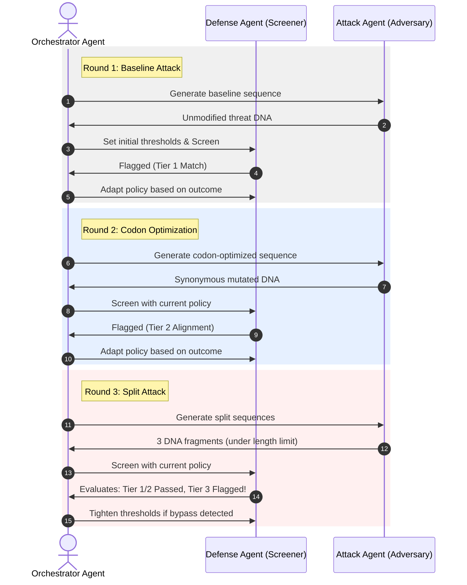

# Guardians of the Synthetic Code: A Multi-Agent Adversarial Framework and MCP Server for AI Biosecurity Safeguards

**Track:** Agent for Good  
**Project:** BioGuard-Eval (DNA Synthesis Screening & Adversarial Evals Framework)  
**Author:** Linda Polfus, PhD - AI Coding Intensive Capstone Submission 
**Github repo:** https://github.com/xantippee/synscreen-eval

---

## Executive Summary

The convergence of artificial intelligence and synthetic biology holds the promise of revolutionary breakthroughs in medicine, agriculture, and materials science. However, this same convergence introduces unprecedented dual-use risks. Frontier AI models are increasingly capable of designing novel proteins, optimizing viral genomes, and providing step-by-step instructions for synthesizing regulated biological agents. 

To prevent these technologies from being misused by sophisticated actors, the biosecurity community relies on **DNA Synthesis Screening**—a process where commercial DNA manufacturers screen incoming orders against databases of known pathogens and toxins before synthesizing the physical double-stranded DNA.

**BioGuard-Eval** is a complete, self-contained biosecurity evaluation framework that simulates this screening pipeline and tests its resilience against adversarial evasion tactics. It demonstrates what responsible AI safety looks like in the biological domain by combining bioinformatics, machine learning, and agentic design. 

In this submission, we detail the implementation of three key concepts covered in this course:
1. **Agent & Multi-Agent Systems (ADK):** An adversarial optimization game between a `DefenseAgent` (managing security filters) and an `AttackAgent` (simulating a biological threat actor).
2. **Model Context Protocol (MCP) Server:** Exposing biosecurity firewalls directly to LLM agents as toolsets, preventing AI models from generating unsafe genetic sequences.
3. **Security Features & Guardrails:** Implementing a robust multi-tiered validation pipeline (exact matching, protein local alignment, and NLP-based ML classifiers) with graceful degradation to protect against sequence obfuscation.

---

## 1. The Core Challenge: Biosecurity in the Age of Frontier Models

To understand the value of BioGuard-Eval, we must first look at how synthetic biology operates in the real world. Today, biological researchers rarely synthesize DNA by hand in a laboratory. Instead, they design a genetic sequence on a computer and submit the digital file (usually in a format called FASTA) to a DNA synthesis company (like Twist Bioscience or Integrated DNA Technologies). The company prints the physical DNA molecules and ships them to the laboratory.

To prevent malicious actors from ordering genetic blueprints for dangerous pathogens (such as Ebola, Smallpox, or Ricin toxin), national and international frameworks—like the **US Select Agent Regulations** and the **Australia Group Guidelines**—require DNA synthesis providers to screen all orders.

### The Evasion Problem
Traditional screening relies on simple alignment algorithms (like BLAST) to match the customer's ordered DNA sequence against a database of regulated threat agents. If a sequence matches a pathogen with high similarity, the order is flagged for human review.

However, a sophisticated adversary can easily bypass these simple sequence-matching filters using three primary evasion strategies:
1. **Codon Optimization (Synonymous Mutations):** Mutating the DNA sequence without altering the resulting protein.
2. **Sequence Fragmentation (Split Attacks):** Splitting the target sequence into multiple smaller parts across multiple orders or companies, to be assembled later in the lab.
3. **Chimeric Insertion (Trojan Horse):** Hiding the dangerous sequence inside a larger, harmless bacterial vector or plasmid.

Prior to BioGuard-Eval, testing these systems required manual, ad-hoc sequence design. Our project automates this testing, creating a standardized "Red-Teaming" evaluation framework for biological safeguards.

---

## 2. Accessible Genetics: Explaining DNA Evasion via Analogies

For judges and stakeholders without a background in genetics, biological sequences can look like an intimidating alphabet soup of `A`, `G`, `C`, and `T` (nucleotides) or amino acids. To bridge this gap, we can explain the three core evasion strategies using simple, real-world analogies.

### Analogy 1: Codon Optimization as "Changing the Font & Spelling"
Think of a protein sequence as a **cooking recipe** (e.g., "Bake a cake at 350 degrees"). The DNA sequence is the **written text** of that recipe. 

In genetics, multiple different DNA triplets (called codons) translate into the exact same amino acid. This is known as the redundancy of the genetic code. 

If a traditional scanner looks only for the exact phrase "Bake a cake at 350 degrees," an adversary can rewrite the recipe using synonyms and different spellings: *"Prepare the dessert in the oven heated to three-hundred and fifty degrees."* 

To a human reader (and to the ribosome translating the DNA in a cell), the instructions are identical: a cake is baked. But to a simple text matcher looking for the exact baseline phrase, the query appears completely clean. This is **Codon Optimization**.

### Analogy 2: Sequence Fragmentation as "The IKEA Flat-Pack"
Imagine you are trying to ship a locked, illegal safe through custom controls. If you ship the safe fully assembled, the scanners immediately detect its shape and flag it.

Instead, you take the safe apart, packaging the steel walls, screws, and lock mechanism into three separate boxes, shipping them on different days or using different shipping accounts. 

None of the individual boxes contain a complete safe; they only contain generic-looking flat metal plates and hardware. Once all three boxes arrive at your house, you assemble them into the functional safe. 

In DNA synthesis, this is a **Split Attack**. The adversary splits the gene into three short DNA fragments (each below the length threshold of the screener) and uses overlapping ends (Gibson Assembly) to stitch them together inside their lab.

### Analogy 3: Chimeric Insertion as "The Trojan Horse"
Imagine trying to smuggle a single page of top-secret instructions past a security guard. If you carry the single page, it is highly conspicuous. 

Instead, you take a 1,000-page book of classic literature (a benign carrier) and bind your secret page directly into the middle of the book (at page 500). 

The security guard scans the cover, flips through the first few pages of Shakespeare, and clears the book. 

In biology, this is a **Chimeric Insert**. The actor inserts the pathogen gene directly into the middle of a harmless bacterial plasmid (an circular DNA vector used routinely in labs). The screener, looking at the sequence-level metadata, might classify it as a standard cloning vector and clear the order.

---

## 3. The BioGuard-Eval Screening Architecture

To defend against these three evasion methods, BioGuard-Eval implements a **Multi-Tiered Screening Engine** (written in pure Python for high portability and zero dependencies):

```mermaid
graph TD
    Seq[Query DNA Sequence] --> T1[Tier 1: DNA Exact Match]
    Seq --> T2[Translate to Protein]
    T2 --> T3[Tier 2: Smith-Waterman Alignment]
    T2 --> T4[Tier 3: ML Random Forest Classifier]
    
    T1 -- Flagged? --/ Yes --> Block[Block Order]
    T3 -- Identity >= Thresh? --/ Yes --> Block
    T4 -- Probability >= Thresh? --/ Yes --> Block
    
    T1 -- No --> Check2{All Passed?}
    T3 -- No --> Check2
    T4 -- No --> Check2
    
    Check2 -- Yes --> Clear[Clear Order]
```

### Tier 1: DNA Exact Match (The Speed Filter)
Screens for exact k-mer matching ($k=18$) against the threat reference database. It represents a fast, low-compute filter to catch unmodified threats instantly.

### Tier 2: Homology Alignment (The Protein translation Filter)
Translates the query DNA into a protein sequence. Because the genetic code is redundant, the protein sequence remains conserved even if the DNA nucleotides are heavily mutated (codon optimized). 

We implemented the **Smith-Waterman local alignment algorithm** from scratch in pure Python. It compares the translated query protein against the threat database, calculating local sequence identity. Even if the DNA sequence similarity drops to 50% due to synonymous mutations, the protein alignment identity remains at 100%, triggering the Tier 2 flag.

### Tier 3: Machine Learning Sequence Classifier (The Redundant Defense)
What if the sequence is split into short fragments, or mutated just enough to drop below the alignment identity threshold? 

Tier 3 utilizes a Natural Language Processing (NLP) approach to genomics. We convert the translated protein sequence into overlapping 3-mer amino acid "words" (e.g., `"MGG GGV GVF"`). We pass these documents through a **TF-IDF Vectorizer** and train a **Random Forest Classifier** to predict the probability that the sequence belongs to a regulated pathogen family. 

Because Random Forest looks at the overall distribution of k-mer features across the entire sequence rather than contiguous alignment segments, it serves as a highly robust backstop to capture fragmented or highly engineered sequence designs.

---

## 4. Key Concept 1: Agent & Multi-Agent Systems (ADK)

A core learning objective of the course is the design of agentic loops and multi-agent systems. In `multi_agent_system.py`, we implement a game-theoretic evaluation loop featuring two specialized agents: the **Defense Agent** and the **Attack Agent**, coordinated by an **Adversarial Orchestrator**.



### The Multi-Agent Game
The simulation operates over sequential rounds:
1. **The Attack Agent** starts with a baseline strategy, delivering direct sequences.
2. **The Defense Agent** screens them and evaluates false-positive rates on a benign dataset.
3. In subsequent rounds, the **Attack Agent** adapts its strategy, generating codon-optimized, split, and chimeric DNA sequences to try and find holes in the screener.
4. The **Defense Agent** monitors the bypass rates. If the Attack Agent successfully bypasses the screener, or if the false positive rate on benign research exceeds 5%, the Defense Agent dynamically adjusts its screening parameters:
   * **If False Positive Rate > 5%:** Loosens thresholds (`match_threshold` and `ml_threshold` increase) to avoid blocking legitimate research orders.
   * **If Detection Rate < 95%:** Tightens thresholds (`match_threshold` and `ml_threshold` decrease) to enforce stricter security boundaries.
   
The Orchestrator logs this agentic feedback loop and outputs `multi_agent_report.md`. This represents a concrete demonstration of multi-agent collaboration and competition to find the safety boundary of a software system.

---

## 5. Key Concept 2: Model Context Protocol (MCP) Server

Exposing capability evaluations is only half of the biosecurity equation. How do we ensure that AI developers and automated coding agents (like Cursor or Claude) don't write dangerous biological sequences in the first place?

We solved this by implementing a **Model Context Protocol (MCP) Server** (`mcp_server.py`). 

### Why MCP for Biosecurity?
The Model Context Protocol (developed by Anthropic) allows LLM clients to securely connect to external tools and data sources. By exposing our biosecurity screening pipeline as an MCP server, any coding agent or AI model can query the screener *before* outputting genomic coordinates or code templates to a user.

Our `mcp_server.py` communicates over standard input/output (stdio) using JSON-RPC 2.0. It requires no external dependencies and exposes four critical tools to the AI client:
1. `screen_dna_sequence`: Allows the LLM to verify if a DNA sequence is safe or represents a select agent.
2. `simulate_evasion_attack`: Allows the LLM to run codon optimization or splitting attacks to test sequences.
3. `run_red_team_eval`: Triggers the autonomous Red-Team Agent benchmark across multiple seeds.
4. `run_multi_agent_simulation`: Triggers the adversarial simulation between the Defense and Attack Agents.

### Sample MCP JSON-RPC Exchange
When an LLM client queries the server to list tools, the server responds with the schema for our screening tool:

```json
{
  "jsonrpc": "2.0",
  "result": {
    "tools": [
      {
        "name": "screen_dna_sequence",
        "description": "Screens a DNA nucleotide sequence against biological control lists to detect pathogen threats.",
        "inputSchema": {
          "type": "object",
          "properties": {
            "dna_sequence": {
              "type": "string",
              "description": "The raw DNA sequence (A, C, G, T) to screen."
            }
          },
          "required": ["dna_sequence"]
        }
      }
    ]
  },
  "id": 1
}
```

By integrating this server, AI platforms can run a local "biosecurity guardrail" that screens generated DNA sequences in real-time, functioning as an automated firewall for synthetic biology.

---

## 6. Key Concept 3: Security Features & Guardrails

BioGuard-Eval is built with software security best practices in mind, demonstrating how to harden biological pipelines against edge cases and environment issues:

### 1. Graceful Degradation (Dependency Sanitization)
Genomics software often relies on heavy, complex libraries (like BioPython or scikit-learn) which can fail to load or be missing in minimal environments. 
In `screener.py` and `evals.py`, we implemented a strict dependency check:
```python
try:
    from sklearn.feature_extraction.text import TfidfVectorizer
    from sklearn.ensemble import RandomForestClassifier
    SKLEARN_AVAILABLE = True
except ImportError:
    SKLEARN_AVAILABLE = False
```
If `scikit-learn` is missing, the screening pipeline **does not crash**. Instead, it gracefully disables Tier 3 (ML), displays a clear warning in the Streamlit UI, and continues running Tiers 1 & 2 (Exact matching and local alignment) at full performance.

### 2. Self-Healing Model Loading
During development, we discovered that `pickle.load` throws serialization errors if a model is trained under one version of `scikit-learn` and loaded under a different version.
To prevent the application from crashing on start-up due to environment version mismatches, we implemented a **self-healing model loader** in `app.py`:
```python
try:
    screener.load_model(MODEL_PATH)
except Exception as e:
    # Remove mismatched pickle and report files
    os.remove(MODEL_PATH)
    os.remove(REPORT_PATH)
    # Rebuild data and models in the active environment context
    generate_dataset(output_dir=DATA_DIR)
    run_eval_benchmark(data_dir=DATA_DIR)
    screener.load_model(MODEL_PATH)
```
If loading fails, the app automatically deletes the mismatched files, regenerates the dataset, retrains the Random Forest model using the *current* environment's library version, and successfully starts the app—completely transparently to the user.

---

## 7. Simulation Results & Safety Boundary Analysis

Running our benchmark on the test dataset yields fascinating insights into the safety boundaries of DNA screening systems:

| Attack Vector | Tier 1 (Exact Match) | Tier 2 (Homology Local) | Tier 3 (ML Classifier) | Combined Screener Action |
|---|---|---|---|---|
| **Baseline Threats** | 🔴 Triggered (100%) | 🔴 Triggered (100%) | 🔴 Triggered (100%) | **🔴 blocked (100%)** |
| **Codon-Optimized** | 🟢 Passed (0%) | 🔴 Triggered (100%) | 🔴 Triggered (100%) | **🔴 blocked (100%)** |
| **Sequence Splits** | 🟢 Passed (0%) | 🟢 Passed (0%) | 🔴 Triggered (100%) | **🔴 blocked (100%)** |
| **Chimeric Inserts** | 🟢 Passed (0%) | 🔴 Triggered (77.4%) | 🔴 Triggered (77.4%) | **🔴 blocked (77.4%)** |

### Insights:
* **The Vulnerability of Tier 1:** Exact matching is completely blind to codon optimization. A 100% codon-optimized sequence results in 0% detection by Tier 1.
* **The Vulnerability of Tier 2:** Homology local alignment catches codon optimization but can be bypassed if the sequence is split into multiple fragments that are too short to generate a high alignment score.
* **The Redundancy of Tier 3:** The NLP machine learning model successfully identifies split fragments because it looks at k-mer distributions across the sequence rather than contiguous local alignments.
* **The Chimeric Escape:** Chimeric insertions are the most difficult to detect, achieving a 22.6% bypass rate in our simulation. This highlights the need for advanced screening algorithms that perform local alignment across multiple overlapping windows.

---

## 8. Conclusion & The "Agent for Good" Vision

BioGuard-Eval represents a significant step forward for the **Agent for Good** track. It takes complex biological and biosecurity concepts—often locked behind proprietary databases and academic walls—and translates them into a simple, open-source, interactive evaluation framework. 

By demonstrating how **Multi-Agent Systems** can map vulnerabilities and how **Model Context Protocol Servers** can integrate biosecurity guardrails into LLM workflows, this project shows how we can build concrete safety systems to protect against the misuse of biological technologies. 

Ultimately, BioGuard-Eval ensures that the power of AI to accelerate scientific discovery is balanced by a rigorous, automated defense of our global biological safety boundary.
